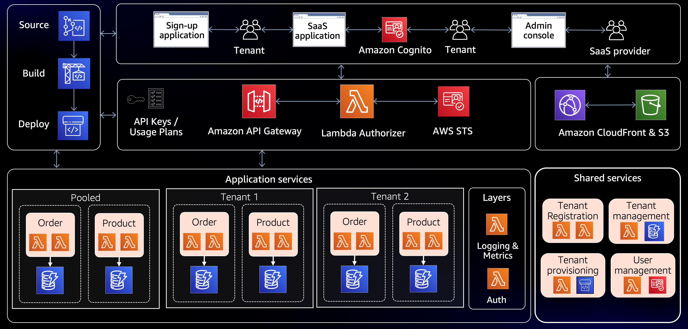

# Multi-Tenant SaaS Infrastructure

This project contains the necessary infrastructure as code (IaC) files to set up a multi-tenant SaaS application on AWS. The architecture is designed to provide scalable, secure, and isolated environments for each tenant, while sharing common infrastructure elements.

## Architecture Overview

The architecture includes:

- **Source, Build, and Deploy**: Infrastructure for continuous integration and continuous deployment (CI/CD).
- **SaaS Application**: The core application logic, deployed as serverless functions in AWS Lambda.
- **Tenant Management**: Systems to handle sign-up, authentication, and tenant isolation.
- **Shared Services**: Common backend services used by all tenants, including databases and shared data layers.
- **Amazon API Gateway**: Entry point for all backend API calls, directing traffic to the appropriate Lambda functions.
- **Amazon Cognito**: User authentication and authorization service.
- **AWS STS**: Security Token Service to grant temporary, limited-privilege credentials for AWS resources.
- **Amazon CloudFront & S3**: Content delivery network (CDN) and storage service for hosting static resources.
- **Application Services**: Lambda functions grouped by tenant, ensuring that each tenant's data and execution context are isolated.
- **Shared Layers**: Common code and dependencies shared across Lambda functions.

## Repository Structure

- `cloudformation/`: Contains the AWS CloudFormation template to provision the infrastructure.
- `terraform/`: Contains the Terraform files to provision the infrastructure.
- `README_CloudFormation.md`: Instructions for deploying with CloudFormation.
- `README_Terraform.md`: Instructions for deploying with Terraform.

Each directory contains further documentation on the specifics of deployment and management.

## Deployment

Refer to the individual README files for detailed instructions on how to deploy the infrastructure using either AWS CloudFormation or Terraform.

- For CloudFormation, see `README_CloudFormation.md`.
- For Terraform, see `README_Terraform.md`.

## Contributing

Contributions to this project are welcome. Please ensure that any changes are documented and that the IaC scripts are thoroughly tested in a development environment before submitting a pull request.
